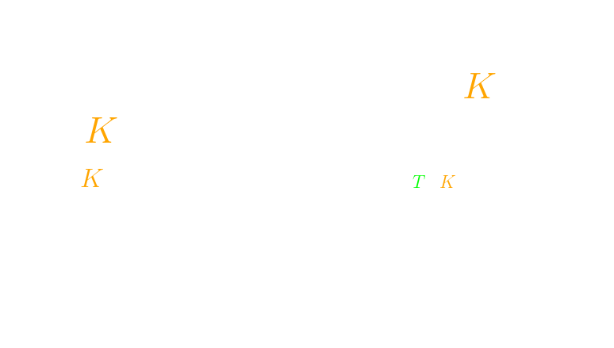
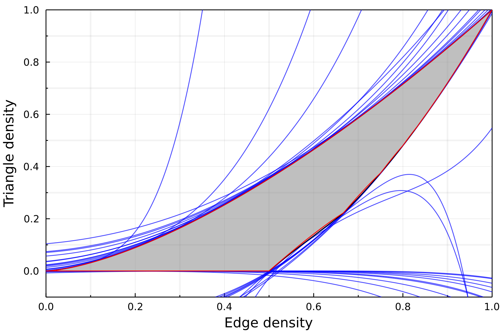
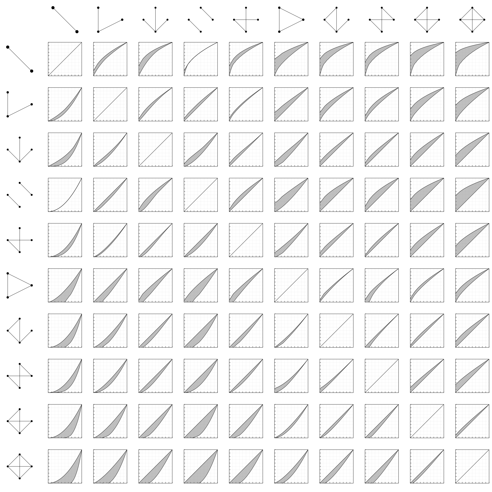
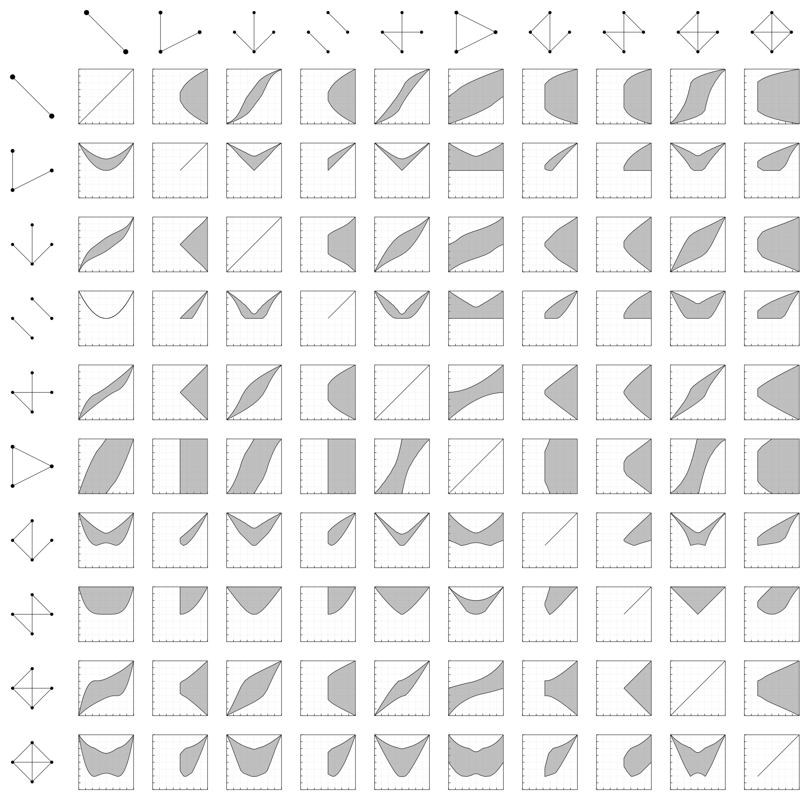

$$\require{color}$$
<!-- reveal-md slides.md -w --theme night -->
<!-- reveal-md slides.md --theme night --static _site -->
<!-- Then copy videos! -->
<!-- and remove _asset paths -->
### Möbius-transformation based symmetry reduction
With application to flag sums-of-squares

 

#### Daniel Brosch
#### Tilburg University $\rightarrow$ Klagenfurt University

 
July 26, 2022

---

## Flag-Algebras

----

### Flag-Algebras

Flag-Algebras were first introduced by **Alexander Razborov** in 2007, and remain one of the most powerful tools in extremal combinatorics. 

They have been used to investigate to dense limits of

- graphs, <!-- .element: class="fragment" data-fragment-index="1"-->
- hypergraphs, <!-- .element: class="fragment" data-fragment-index="2"-->
- directed graphs, <!-- .element: class="fragment" data-fragment-index="3"-->
- permutations, <!-- .element: class="fragment" data-fragment-index="4"-->
- point order types, <!-- .element: class="fragment" data-fragment-index="5"-->
- and much more! <!-- .element: class="fragment" data-fragment-index="6"-->

 In this talk, we will focus on the case of graphs. <!-- .element: class="fragment" data-fragment-index="7"-->

Note: Razborov unifies and generalizes ideas of many authors.

----

### How many edges can there be in a triangle free graph?

<video class="fv-video" src="./videos/TriangleFree.mp4" fv-playback-info="./videos/TriangleFree.json">
</video>

----

### Triangle free graphs

To formally define the optimization problem, we let

$${\color{orange}\mathcal{G}} = ({\color{orange}G_i})_{i\geq 1}$$

be a sequence of graphs, where each graph $\color{orange}G_i$ has $i$ vertices.

The density of a graph $\color{green}H$ in $\color{orange}\mathcal{G}$ is
$$p({\color{orange}\mathcal{G}}, {\color{green}H}) := \lim_{i\to\infty} \mathbb{P}[{\color{red}\sigma_i}({\color{green}H}) \text{ is a subgraph of }{\color{orange}G_i}],$$
where ${\color{red}\sigma_i}$ is a random permutation in $S_i$.

Maximize the edge density in a triangle free sequence $\mathcal{G}$ of graphs of increasing size:

We saw that

but how do we find an upper bound?

Note: Non-induced subgraphs count

----

### Multiplying subgraph densities

If we multiply two subgraph densities, we glue together the graphs:

Because the probability that the two graphs are sent to disjoint sets of vertices converges to $1$ in the limit. 

These relationships are independent of $\mathcal{G}$, motivating the notation

where a graph $H$ now stands for the function
$$H(\mathcal{G}) =  p(\mathcal{G},H).$$

We can now restrict the randomly chosen permutations $\sigma_i$ to fix (flag) some vertices, and extend the gluing operation to partially labeled graphs (Flags):

----

### Flag Sums-of-Squares

As Flags send graph sequences to *real numbers*, squaring a linear combination of Flags results in a function that sends graph sequences to a nonnegative number:

A linear combination of Flags is called a Quantum-Flag.

We can average Flags over all choices of labels, unlabeling them:

Note: Averaging preserves nonnegativity.

We can now find an upper bound for the edge density in triangle free graphs:

As for polynomial optimization, we can model Flag-SOS using semidefinite programming.

---

### Flags as (limits of) polynomials

Recently, **Raymond**, **Saunderson**, **Singh** and **Thomas** have proven a fascinating connection of Flag-SOS and polynomial SOS: 

 

- Flags can be seen as limits of sequences of polynomials.
- Partially exploiting the polynomials' symmetries and taking the limit leads to Flag-SOS.

We exploit their symmetries fully!<!-- .element: class="fragment" data-fragment-index="1"-->

Maximizing the edge density in a triangle-free graph can be reformulated as:

\begin{align}
    \lim_{n\to\infty}\max \enspace&{\color{orange}\frac{1}{\binom n 2}\sum_{1\leq i<j\leq n} x_{ij}}\\\\
    \text{s.t.}\enspace & {\color{green}\frac{1}{\binom{n}{3}}\sum_{1\leq i<j<k\leq n} x_{ij}x_{ik}x_{jk}} = 0,\\\\
    & x_{ij}\in\\{0,1\\} \quad \text{for all } i < j.
\end{align}

We introduce binary variables corresponding to edges:

$$ x_{ij} \in \\{0,1\\} \quad \text{for } i < j. $$

Subgraph densities are polynomials invariant under $\color{orange}{S_n}$ acting simultanously on the indices:

$${\color{orange}\sigma}(x_{ij}) = x_{{\color{orange}\sigma}(i){\color{orange}\sigma}(j)}.$$

We can exploit this symmetry!

Note: Monomials = fully labeled graphs. Action corresponds to permuting labels.

---

### Main reduction idea:

Formulate the problem as a sequence of highly symmetric polynomial optimization problems

 

Exploit the symmetries for each finite $n$

 

The resulting hierarchies have block-sizes independent of $n$, we can take the limit!

---

## Main contributions

We fully exploit the symmetries of two hierarchies:

- Lasserre hierarchy for Flags with few edges       

- Razborov hierarchy for Flags with few vertices     

 

This talk focuses on the Razborov hierarchy.

We lay the groundwork for a few novel ideas:

Extension of Flag-Algebras to degenerate extremal combinatorics.

A harmonic basis and Fourier decomposition of Flags.

A generalization of Razborov's partial derivatives of Flags.

---

## SDP Symmetry reduction basics

 

 <!-- .element: class="r-stretch" -->

----

### Symmetric sums of squares

$S_n$ acts here on the basis ${\color{red}[x]}$ of monomials.

This action permutes the rows and columns of the positive semidefinite matrix $X$ in the SOS-term

\begin{align}
{\color{orange}\sigma}({\color{red}[x]}^TX{\color{red}[x]}) &= {\color{orange}\sigma}({\color{red}[x]})^TX{\color{orange}\sigma}({\color{red}[x]})\\\\
&= {\color{red}[x]}^T\left(X_{{\color{orange}\sigma}(m_1),{\color{orange}\sigma}(m_2)}\right)_{m_1,m_2\in {\color{red}[x]}}{\color{red}[x]}\\\\
&= {\color{red}[x]}^T{\color{orange}\sigma}(X){\color{red}[x]}
\end{align}

If $X$ is positive semidefinite, then ${\color{orange}\sigma}(X)$ is as well!

----

### How do we exploit symmetries?

As the feasible set of an SDP is **convex**, we can **average** feasible solutions:

$$\mathcal{R}(X) = \frac{1}{|{\color{orange}G}|} \sum_{{\color{orange}\sigma}\in {\color{orange}G}}{\color{orange}\sigma}(X)$$

$\mathcal{R}(X)$ is again feasible, with the same objective value as $X$!

----

### Symmetric optimal solutions

If $X^*$ is an optimal solution, then so is $\mathcal{R}(X^*)$. This solution is invariant under actions of ${\color{orange}G}$:
$${\color{orange}\sigma}(\mathcal{R}(X^*)) = \mathcal{R}(X^*). $$

We can restrict the SDP to optimize only over invariant matrices:
\begin{align}
\inf\enspace&\langle C,X\rangle \\\\
\text{s.t.}\enspace& \langle A_i, X\rangle = b_i\quad \text{for all } i,\\\\
& X\succcurlyeq 0,\\\\
& {\color{orange}\mathcal{R}(X)=X}.\\\\
\end{align}

In the case of ${\color{orange}G}=D_{10}=C_5\times Z_2$ we can restrict $X$ to have the **pattern**

$$\begin{pmatrix}
{\color{red}A} & {\color{orange}B} & {\color{green}C} & {\color{green}C} & {\color{orange}B}\\\\
{\color{orange}B} & {\color{red}A} & {\color{orange}B} & {\color{green}C} & {\color{green}C}\\\\
{\color{green}C} & {\color{orange}B} & {\color{red}A} & {\color{orange}B} & {\color{green}C}\\\\
{\color{green}C} & {\color{green}C} & {\color{orange}B} & {\color{red}A} & {\color{orange}B} \\\\
{\color{orange}B} & {\color{green}C} & {\color{green}C} & {\color{orange}B} & {\color{red}A}\\\\
\end{pmatrix}$$ 

----

### Block-diagonalization

$$\tiny\begin{pmatrix}
{\color{red}A} & {\color{orange}B} & {\color{green}C} & {\color{green}C} & {\color{orange}B}\\\\
{\color{orange}B} & {\color{red}A} & {\color{orange}B} & {\color{green}C} & {\color{green}C}\\\\
{\color{green}C} & {\color{orange}B} & {\color{red}A} & {\color{orange}B} & {\color{green}C}\\\\
{\color{green}C} & {\color{green}C} & {\color{orange}B} & {\color{red}A} & {\color{orange}B} \\\\
{\color{orange}B} & {\color{green}C} & {\color{green}C} & {\color{orange}B} & {\color{red}A}\\\\
\end{pmatrix}
$$

is positive semidefinite if and only if

* ${\color{red}A} + {\color{orange}B} + {\color{green}C} \geq 0$,
* ${\color{red}A} +\frac{\sqrt{5}-1}{4}{\color{orange}B} - \frac{\sqrt{5}+1}{4}{\color{green}C} \geq 0$,
* ${\color{red}A} -\frac{\sqrt{5}+1}{4}{\color{orange}B}+\frac{\sqrt{5}-1}{4}{\color{green}C} \geq 0$.

In general we may still get multiple bigger blocks

but the sum of the block sizes is often significantly lower than $n$!

Note: This linearizes the problem.

---

## Lasserre style hierarchy
#### Prioritizing Flags with few edges

<!-- 
 -->

----

### The Lasserre hierarchy

The $\color{orange}d$'th level of the Lasserre hierarchy limits the degree of appearing monomials to at most $2{\color{orange}d}$.

 

We optimize over sums of squares of the form

$${\color{red}[x]}^T X  {\color{red}[x]},$$

where $X\succcurlyeq 0$ and ${\color{red}[x]}$ is a basis of 
$$ \mathbb{R}[x]_{\leq {\color{orange}d}}.$$

As monomials correspond to fully labeled graphs, we here have

$${\color{red}[x]} = \\{H : H \text{ graph with at most $\color{orange}d$ edges}\\}.$$

----

### Reducing the Lasserre hierarchy

New tools for the representation theory of $S_n$: We can decompose quotients of permutation modules
$$ M^\lambda / G,$$
where $G$ acts on the rows of $\lambda$ into irreducible submodules.

This results in a symmetry adapted basis for flag algebras, which we call Specht-flags:

But this is not the focus of this talk.
<!-- .element: class="fragment" data-fragment-index="2"-->

---

## Razborov style hierarchy
#### Prioritizing Flags with few vertices

----

### Möbius-transformations

Well-known fact: The $n$'th level of the Lasserre hierarchy is sharp. 

 

Proof idea: Applying a Möbius-transformation to the rows and columns of the SDP diagonalizes the hierarchy.

Example: Optimize over two binary variables $x_1,x_2\in\\{0,1\\}.$

 

The second level of the Lasserre hierarchy involves a matrix $\color{orange}X$ of the form
$$\small\begin{pmatrix}1 & x_1 & x_2 & x_1x_2\\\\
x_1 & x_1 & x_1x_2 & x_1x_2\\\\
x_2 & x_1x_2 & x_2 & x_1x_2\\\\
x_1x_2 & x_1x_2 & x_1x_2 & x_1x_2\end{pmatrix} $$

The Möbius-transformation assigns the following

$$\begin{align}1 &\longrightarrow (1-x_1)(1-x_2)\\\\
x_1 &\longrightarrow x_1(1-x_2)\\\\
x_2 & \longrightarrow (1-x_1)x_2\\\\
x_1x_2 & \longrightarrow x_1x_2\end{align}$$

We multiply monomials $m$ with $(1-x_i)$ for all $x_i$ not appearing in $m$.

As $\color{orange}x_i(1-x_i)=0$, applying the transformation to the rows and columns of $\color{orange}X$ diagonalizes the matrix:

$$\scriptsize\substack{\begin{pmatrix}1 & x_1 & x_2 & x_1x_2\\\\
x_1 & x_1 & x_1x_2 & x_1x_2\\\\
x_2 & x_1x_2 & x_2 & x_1x_2\\\\
x_1x_2 & x_1x_2 & x_1x_2 & x_1x_2\end{pmatrix} \\\\\downarrow \\\\\begin{pmatrix}(1-x_1)(1-x_2) & & &\\\\&x_1(1-x_2)&&\\\\&&(1-x_1)x_2&\\\\&&&x_1x_2\end{pmatrix}}$$

----

### Möbius-transformation based symmetry reduction

Normally, we can only apply the transformation to the final level of the Lasserre hierarchy.

 

We truncate the Lasserre hierarchy in such a way, that we can apply the transformation earlier to sub-problems, partially diagonalizing it.

----

### Back to flag algebras

We are in the setting of 
- variables $x_{ij}\in\\{0,1\\}$ corresponding to edges,
- monomials $m$ corresponding to graphs.

----

### Prioritizing small graphs

<!-- STACK 1 -->

**Razborov** prioritizes Flags with few vertices. Let $\color{green}T$ be the maximum number of vertices we want to appear. 

We optimize over sums of squares
$$\sum p_i^2, $$
where each square $p_i^2$ does not contain a monomial with more than $\color{green}T$ vertices.

<!-- STACK 2 -->

We optimize over

$${\color{red}[x]}^T X  {\color{red}[x]},$$

where ${\color{red}[x]}$ contains monomials with at most ${\color{green}T}$ vertices, where $X$ has a rank one decomposition
$$X = X_1 + \ldots + X_k,$$
where each ${\color{red}[x]}^T X_i  {\color{red}[x]}$ is a linear combination of graphs with at most $\color{green}T$ vertices.

<!-- STACK 3 -->

The $X_i$ correspond exactly to the maximal 
cliques in the sparsity pattern given by
$$ (X_i)_{G,H} = 0 \quad\text{if $GH$ has more than $\color{green}T$ vertices}.$$

----

### The maximal cliques

For each ${\color{orange}K}\leq {\color{green}T}$ with ${\color{orange}K}\enspace\mathrm{mod}\enspace 2\equiv {\color{green}T}$, the maximal clique $\mathcal{B}_{\color{orange}K}$ contains the graphs of the form:

<!--  -->

Products of graphs within the same $\mathcal{B}_{\color{orange}K}$ result in a graph with at most $\color{gree}T$ vertices!

----

### Symmetry reduction

Symmetry reduction is trivial: We only consider the maximal cliques up to symmetry!

----

### Möbius transformation

Each clique $\mathcal{B}_{\color{orange}K}$ is closed under addition of edges within $[{\color{orange}K}]$.

 

$\longrightarrow$ Möbius-transformation on the first $\color{orange}K$ vertices. 

If $G\vert_{[{\color{orange}K}]} \neq H\vert_{[{\color{orange}K}]}$, then the product of the transformed graphs is zero.

 

$\longrightarrow$ One block for each graph. We only need graphs up to isomorphism! <!-- .element: class="fragment"-->

----

### Breaking Schur's Lemma

Let $\color{orange}M$, $\color{orange}N$ be two **irreducible** $G$-modules over a ring $R$. Let ${\color{limegreen}\varphi} : {\color{orange}M}\to {\color{orange}N}$ be a homomorphism.

- If $\color{orange}M$ and $\color{orange}N$ are not isomorphic, then ${\color{limegreen}\varphi} \equiv 0$. 
- If ${\color{orange}M}\simeq {\color{orange}N}$ and $R$ is an algebraically closed field, then ${\color{limegreen}\varphi} = c\mathrm{I}$ for a $c\in R$. 

 

We optimize over $\{0,1\} = \mathbb{Z}_2$, which is not algebraically closed!

Both modules are isomorphic to the module $M^{(1,1)}$, but also orthogonal to each other, as $x_{12}(1-x_{12}) = 0$.

----

### Additional symmetries

We obtain one block for each graph $\color{green}G$ with up to $\color{green}T$ vertices.

 

The symmetries of each block are now given by
$$\mathrm{Aut}({\color{green}G}) \times S_{n-|V({\color{green}G})|} $$
The symmetry groups are complicated!

 

We can still block-diagonalize the algebra numerically.

----

### Connection to Razborov's hierarchy

We obtain blocks for each Graph ${\color{green}G}$ with symmetry
$$\mathrm{Aut}({\color{green}G}) \times S_{n-|V({\color{green}G})|}. $$

We obtain the Flag Algebra $\mathcal{A}^{\color{green}G}$ of type ${\color{green}G}$ by restricting to the elements invariant under 
$$S_{n-|V({\color{green}G})|}.$$
----

### Comparing the hierarchies

In the setting of (undirected) graphs we have 
  \begin{equation}
    \mathrm{Las}_{2{\color{orange}d}} \geq \mathrm{Raz} _{4\color{orange}d}\geq  \mathrm{Vert} _{4{\color{orange}d}}
  \end{equation}
  and
  \begin{equation}
    \mathrm{Raz} _{\color{green}T} \geq \mathrm{Vert} _{\color{green}T} \geq \mathrm{Las} _{2\binom{{\color{green}T}}{2}},
  \end{equation}
where lower means better.
---

### Graph-profiles

Let $\color{orange}G$ and $\color{green}H$ be two (Quantum-)Graphs.

The Graph-profile of $\color{orange}G$ and $\color{green}H$ is the set of possible values

$$\left\lbrace (p(\mathcal{G}, {\color{orange}G} ), p(\mathcal{G}, {\color{green}H} )) : \mathcal{G} \text{ sequence of graphs}\right\rbrace.$$

Razborov calculates the triangle-edge graph profile:

<!--  -->

<!--  -->

We can find an outer approximation of graph profiles by solving

$$\max \int_0^1 f \text{ s.t. } {\color{orange}G} - f({\color{green}H}) \geq 0,$$

for a lower bound, where $f$ is a univariate polynomial. We solve a similar problem for an upper bound.

One function is not enough:

Cutting $[0,1]$ into many intervals works well:

Note: Very few known; edge + Kn, some approximations of slices of profile of small graphs.

----

----

## Harmonic Flags

We found a basis of the Flag-Algebra of elements we call harmonic Flags. These come from the characters of the binary hypercube, and are a basis of limits of orthogonal polynomials.

----

---

## Software

A Julia package implementing the fully reduced hierarchies (and much more!) for arbitrary Flags will be available very soon.

--- 

## Paper

Should be online soon-ish. It will be first available as part of my thesis draft.